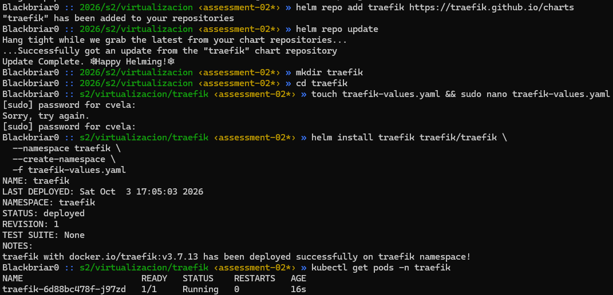
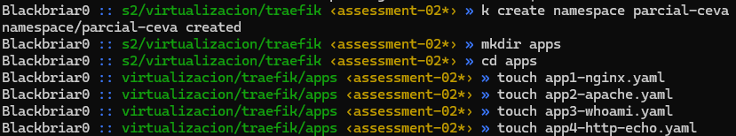
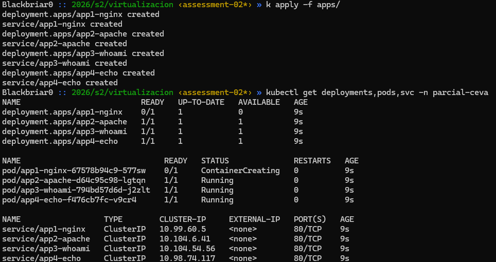
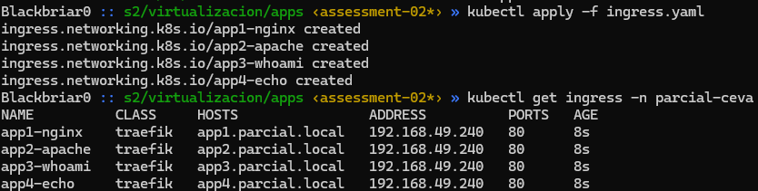
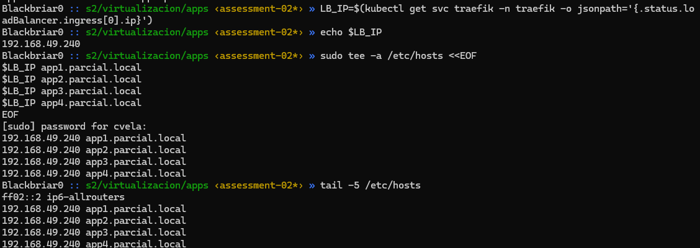
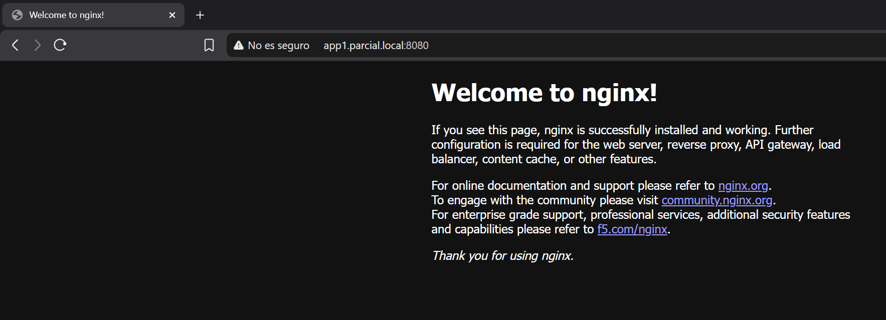
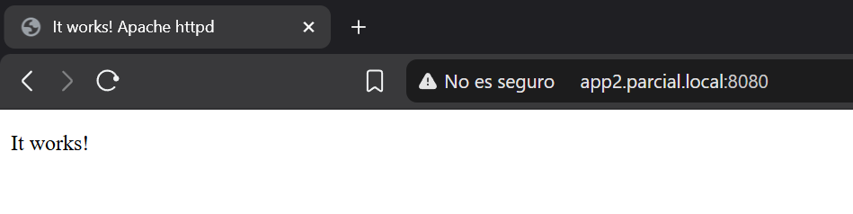
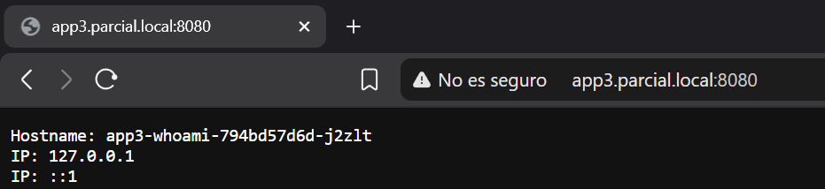
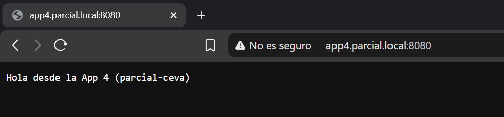
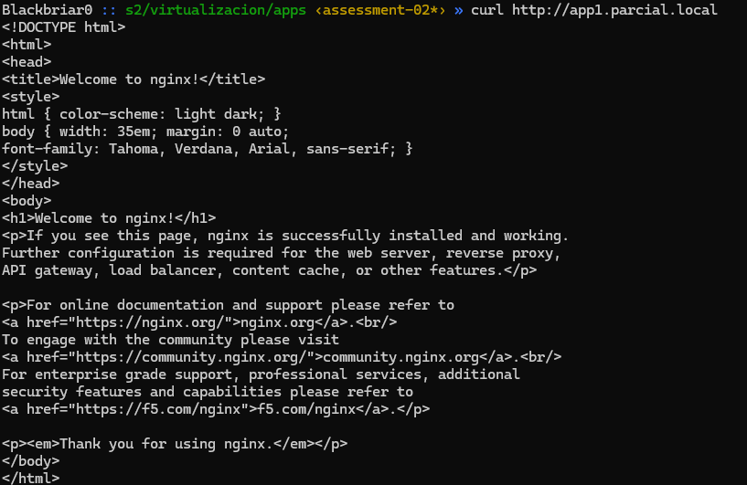

# Evaluación Parcial II

## Paso 1: Instalación de MetalLB | Definicion de IP MetalLB

* Instalación

```
> mkdir metallb && curl -L -o metallb/metallb-native.yaml \ https://raw.githubusercontent.com/metallb/metallb/v0.16.1/config/manifests/metallb-native.yaml

> k apply -f metallb/metallb-native.yaml
```


* Definicion de IP

metallb/metallb-config.yaml
```
apiVersion: metallb.io/v1beta1
kind: IPAddressPool
metadata:
  name: single-ip-pool
  namespace: metallb-system
spec:
  addresses:
    - 192.168.49.240/32
---
apiVersion: metallb.io/v1beta1
kind: L2Advertisement
metadata:
  name: l2-adv
  namespace: metallb-system
spec:
  ipAddressPools:
    - single-ip-pool
```

### IP Definida: 192.168.49.240/32

Comprobacion y aplicacion:


## Paso 2: Configuracion Traefik

* Configuracion de Traefik

traefik/traefik-values.yaml
```
service:
  type: LoadBalancer
  annotations:
    metallb.io/loadBalancerIPs: 192.168.49.240
ingressClass:
  enabled: true
  isDefaultClass: true
providers:
  kubernetesIngress:
    enabled: true
  kubernetesCRD:
    enabled: true
```

* Instalacion y comprobacion



## Paso 3: Configuracion de namespace "parcial-ceva"

Servicios:
* nginx *(apps/app1-nginx.yaml)*
* apache *(apps/app2-apache.yaml)*
* whoami *(apps/app3-whoami.yaml)*
* http-echo *(apps/app4-http-echo.yaml)*

### Aplicar los servicios:






## Paso 4: Configuracion de Ingress

**Ruta Ingress:** apps/ingress.yaml



* Escritura en /etc/hosts



## Paso 5: Pruebas finales

### Verificación de dominios con port-forwarding

```
> kubectl port-forward -n traefik svc/traefik 8080:80 & sleep 2
```

* nginx

* apache

* whoami

* http-echo


Llamada a Nginx desde Ubuntu con "curl"


