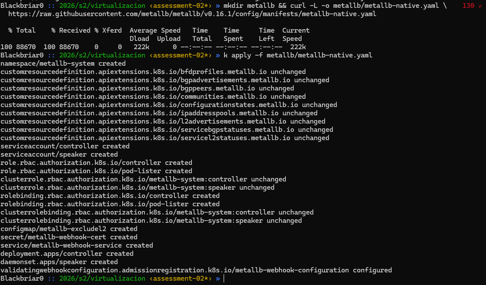
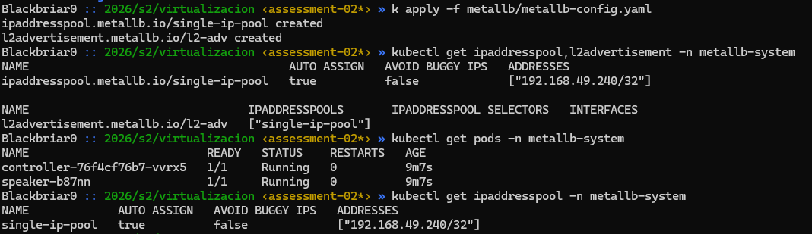

# Evaluación Parcial II

## Paso 1: Instalación de MetalLB | Definicion de IP MetalLB

* Instalación

```
> mkdir metallb && curl -L -o metallb/metallb-native.yaml \ https://raw.githubusercontent.com/metallb/metallb/v0.16.1/config/manifests/metallb-native.yaml

> k apply -f metallb/metallb-native.yaml
```



* Definicion de IP

metallb/metallb-config.yaml
```
apiVersion: metallb.io/v1beta1
kind: IPAddressPool
metadata:
  name: single-ip-pool
  namespace: metallb-system
spec:
  addresses:
    - 192.168.49.240/32
---
apiVersion: metallb.io/v1beta1
kind: L2Advertisement
metadata:
  name: l2-adv
  namespace: metallb-system
spec:
  ipAddressPools:
    - single-ip-pool
```

### IP Definida: 192.168.49.240/32

Comprobacion y aplicacion:



